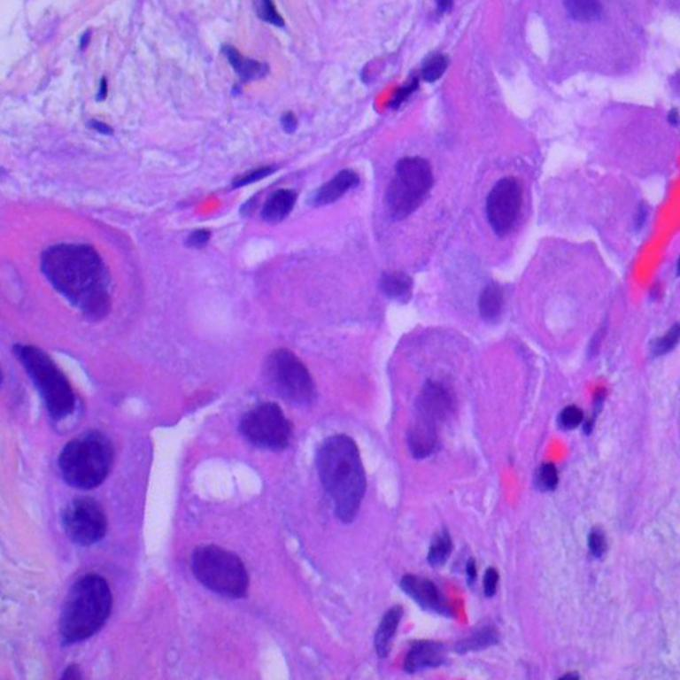
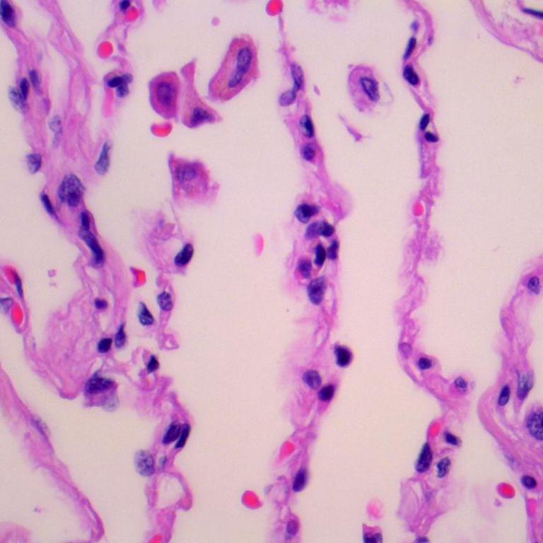
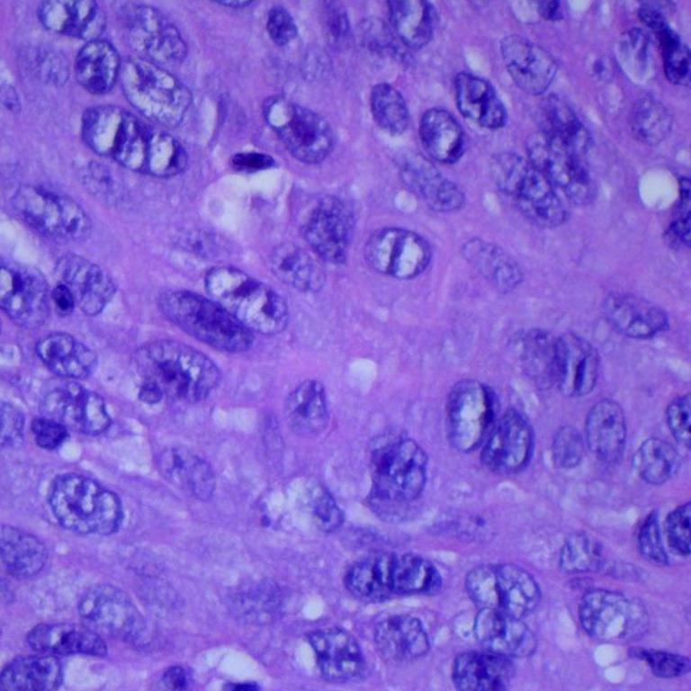
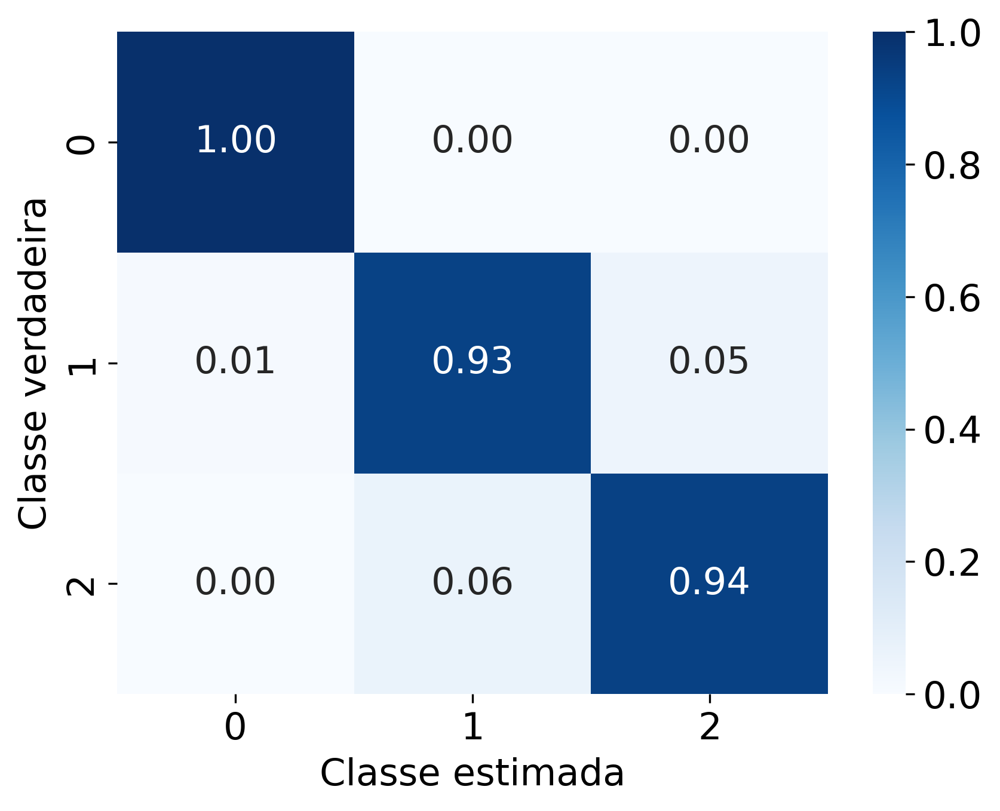
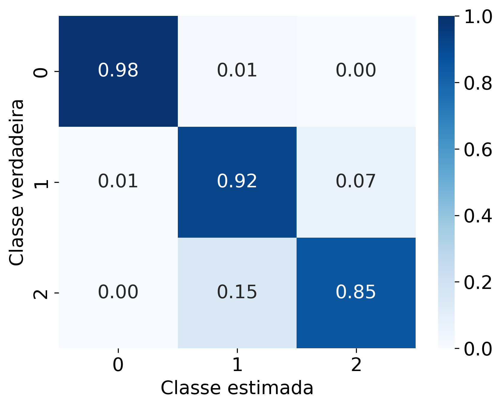

# Projeto - Classificador de Imagens Histopatológicas de Câncer Pulmonar

Segundo projeto apresentado na displina de Inteligência Computacional em Saúde ministrada pelo professor [Andre Georghton Cardoso Pacheco](https://github.com/paaatcha). Os alunos envolvidos no desenvolvimento foram:
<ul>
    <li>Luiz Carlos Cosmi Filho</li>
        <a href="http://lattes.cnpq.br/7512442154273401">
            
        </a>
        <a href="mailto:luizcarloscosmifilho@gmail.com">
            
        </a>
        <a href="https://www.linkedin.com/in/luizcarloscf/">
            
        </a>
        <a href="https://github.com/luizcarloscf">
            
        </a>
    <li>Mateus Sobrinho Menines</li>
        <a href="http://lattes.cnpq.br/0283141894444882">
            
        </a>
        <a href="mailto:mateus.sobrinho09@gmail.com">
            
        </a>
        <a href="https://www.linkedin.com/in/mateus-sobrinho-868147256/">
            
        </a>
        <a href="https://github.com/MateusSMenines">
            
        </a>
</ul>

## Sumário

- [Base de dados](#base-de-dados)
- [Instalação](#instalação)
    - [Ambiente virtual](#ambiente-virtual)
    - [Obtendo o projeto](#obtendo-o-projeto)
    - [Instalando as dependências e o projeto](#instalando-as-dependências-e-o-projeto)
    - [Executando](#executando)
- [Resultados](#resultados)
- [Licença](#licença)

## Base de dados

A base de dados utilizada neste projeto corresponde a um conjunto de dados de imagens histopatológicas de câncer de pulmão e cólon chamado [LC25000](https://arxiv.org/abs/1912.12142v1). Contém 25.000 imagens histopatológicas (RGB) com resolução de 728x728 de tecidos do pulmão e cólon, distribuídas em 5 classes, com cada classe tendo 5.000 imagens: (i) Adenocarcinoma de Cólon; (ii) Tecido Benigno do Cólon; (iii) Adenocarcinoma Pulmonar; (iv) Tecido Pulmonar Benigno; (v) Carcinoma de Células Escamosas Pulmonar. É importante mencionar que esses tecidos foram preparados utilizando uma técnica de coloração com hematoxilina e eosina. Nesse trabalho, serão utilizadas apenas as imagens relativas a **tecidos pulmonares**.

|Classe                                   |  Exemplo                           |
|:---------------------------------------:|:----------------------------------:|
| Adenocarcinoma Pulmonar                 |  | 
| Tecido Pulmonar Benigno                 |    |
| Carcinoma de Células Escamosas Pulmonar |  |


Para execução do projeto, os dados devem ser baixados no link disponibilizado acima e colocados na pasta [`data`](./data) seguindo a estrutura:

```bash
.
└── data
    ├── examples
    └── lung_colon_image_set
        ├── colon_image_sets
        │   ├── colon_aca
        │   │   ├── colonac0.jpeg
        │   │   .
        │   │   .
        │   │   .
        │   │   └── colonac5000.jpeg
        │   └── colon_n
        │       ├── colonn0.jpeg
        │       .
        │       .
        │       .
        │       └── colonn5000.jpeg
        └── lung_image_sets
            ├── lung_aca
            │   ├── lungaca0.jpeg
            │   .
            │   .
            │   .
            │   └── lungaca5000.jpeg
            ├── lung_n
            │   ├── lungn0.jpeg
            │   .
            │   .
            │   .
            │   └── lungn5000.jpeg
            └── lung_scc
                ├── lungscc0.jpeg
                .
                .
                .
                └── lungscc5000.jpeg
```

## Instalação

As instruções de instalação a seguir são apresentadas para o sistema operacional [Ubuntu](https://ubuntu.com/). 

> ⚠️ Aviso: Testado apenas no [Ubuntu 22.04](https://releases.ubuntu.com/jammy/).


### Ambiente virtual

O pacote `python3-venv` é necessário para criar ambientes virtuais Python. Para instalá-lo no Ubuntu 22.04, execute o seguinte comando:

```bash
sudo apt-get install python3-venv
```

### Obtendo o projeto

Agora, vamos clonar um repositório Git e criar um ambiente virtual Python:

```bash
# Baixe o projeto
git clone https://github.com/intel-comp-saude-ufes/2024-1-P2-classificador-cancer-de-pulmao.git

# Entre na pasta do projeto
cd 2024-1-P2-classificador-cancer-de-pulmao/

# Crie um ambiente virtual com nome '.venv'
python3 -m venv .venv

# Ative o ambiente virtual
source .venv/bin/activate
```

### Instalando as dependências e o projeto

Uma vez no ambiente virtual, instale as dependências do projeto e o próprio projeto usando `pip`. Caso você não o tenha instalado em seu computador, basta executar:

```bash
sudo apt-get install python3-pip
```

Então, você pode prosseguir com a instalação das dependências do projeto e do próprio projeto:

```bash
pip3 install .
```

### Executando

Inicialmente, é necessário executar o script [project/split.py](project/split.py). Para isso, basta executar:

```bash
split
```

Assm, 4 arquivos serão gerados:

* `data/all.csv`
* `data/train.csv`
* `data/test.csv`
* `data/val.csv`

Os arquivos gerados são tabelas que apresentam uma coluna com o caminho para o arquivo de imagem e em outra coluna o rótulo associado aquela imagem. Essa divisão entre treino, teste e validação, feita pelos arquivos `train.csv`/`test.csv`/`val.csv`, é realizada aleatoriamente e estratificando os conjuntos. São utéis para testar o script de treinamento. Já no procedimento de validação cruzada é utilizado o arquivo `all.csv` contendo todo o banco de dados.

Então, para executar um simples treinamento utilizando a divisão sugerida pelo script [project/split.py](project/split.py), basta executar:

```bash
train
```

> ⚠️ Devido a quantidade de arquivos, este procedimento demora em torno de 1h30min. Ao final dele, as métricas de treinamento estarão salvas em [data/resnet50](data/resnet50) e em [data/vgg19](data/vgg19). Os arquivos gerados dentro de cada uma das pastas serão:
>
> * `best_checkpoint.pth`: melhor modelo encontrado (aquele que miniza a perda sobre o conjunto de validação);
> * `last_checkpoint.pth`: o último modelo;
> * `test_inference.csv`: resultado da inferência sobre o conjunto de teste;
> * `train_metrics.csv`: métricas (função de perda e acurácia) durante o treinamento.


Por outro lado, para executar o procedimento de validação cruzada com 5 divisões, basta executar:
```bash
cross-val
```

> ⚠️ Devido a quantidade de arquivos, este procedimento demora em torno de 15h. Ao final dele, as métricas de treinamento estarão salvas em:
>
> * Resnet:
>   * [data/resnet50_fold_0](data/resnet50_fold_0) 
>   * [data/resnet50_fold_1](data/resnet50_fold_1) 
>   * [data/resnet50_fold_2](data/resnet50_fold_2) 
>   * [data/resnet50_fold_3](data/resnet50_fold_3) 
>   * [data/resnet50_fold_4](data/resnet50_fold_4) 
> * VGG-19:
>   * [data/vgg19_fold_0](data/vgg19_fold_0) 
>   * [data/vgg19_fold_1](data/vgg19_fold_1) 
>   * [data/vgg19_fold_2](data/vgg19_fold_2) 
>   * [data/vgg19_fold_3](data/vgg19_fold_3) 
>   * [data/vgg19_fold_4](data/vgg19_fold_4) 
>
> Os arquivos gerados dentro de cada uma das pastas serão:
>
> * `best_checkpoint.pth`: melhor modelo encontrado (aquele que miniza a perda sobre o conjunto de validação);
> * `last_checkpoint.pth`: o último modelo;
> * `test_inference.csv`: resultado da inferência sobre o conjunto de teste;
> * `train_metrics.csv`: métricas (função de perda e acurácia) durante o treinamento.

Para analisar os resultados da validação cruzada, está disponível o seguinte Jupyter Notebook: [notebooks/project.ipynb](notebooks/project.ipynb). Para executá-lo, basta abrir o Jupyter Lab executando:

```bash
jupyter-lab
```

## Resultados

A apresentação do projeto foi disponibiliza no YouTube no seguinte link:

[](https://www.youtube.com/watch?v=72hnkxTNnqw)

Além disso, o relatório/artigo descrevendo o projeto pode ser encontrado em [results/report.pdf](results/report.pdf). Nele é realizada uma discussão do problema, trabalhos relacionados, metodologia, resultados e trabalhos futuros. Sobre cada divisão gerada no processo de validação cruzada, uma matriz de confusão foi calculada sobre o conjunto de teste em específico. A média das matrizes de confusões para os dois modelos avaliados pode ser observada a seguir:


| VGG-19                  |  Resnet50                |
|:-------------------------:|:-------------------------:
  |  

Os resultados mostram que a utilização de qualquer um dos classificadores em uma aplicação em produção apresentariam resultados semelhantes. Assim, poderia-se utilizar os algoritmos como uma ferramenta para melhorar a eficiência no diagnóstico de câncer de pulmão utilizando imagens histopatológicas.

## Licenças

Este projeto é licenciado sob os termos da [licença MIT](./LICENSE) e está disponível gratuitamente.